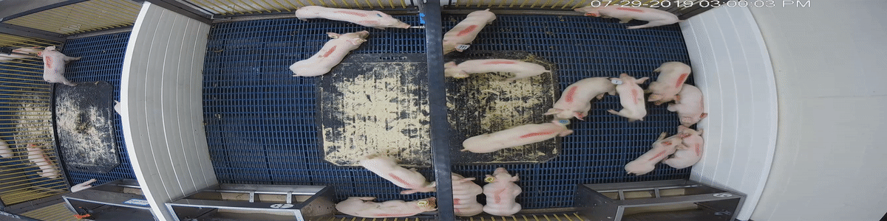

# ditection-and-track

### abstract
- Using watershed algorithm to recognized and mark multiple pigs in video.
- Using opencv tracker (KCF tracker) and Hungarian algorithm to track
recognized pigs.

### install the lib
- Run `pip install -r requirements.txt`
### find multiple pigs in video
- Run `python find_pig.py`
### find and track multiple pigs in video
- Run `python find_and_track_pig.py`

### Show
- the data was download in  http://psrg.unl.edu/Projects/Details/12-Animal-Tracking

